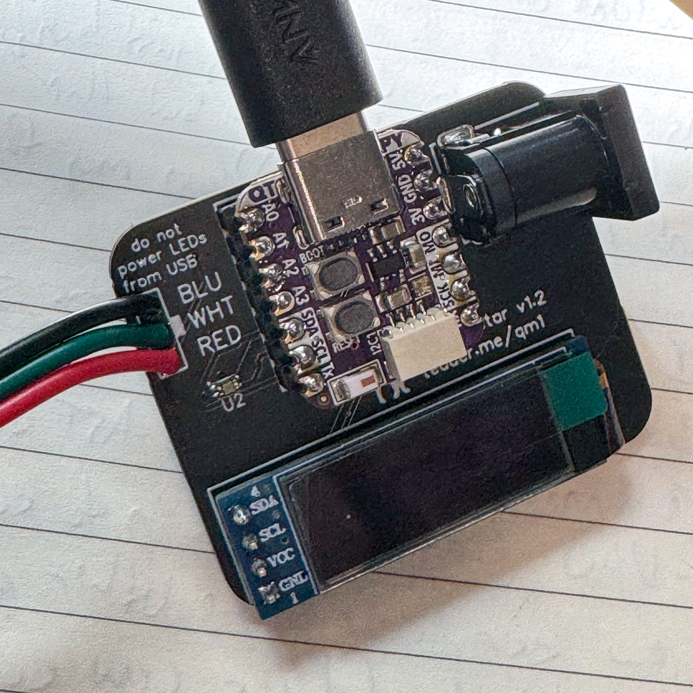

## setup notes

1. Connect the controller to your computer with a USB-C cable. You should see files, like a USB stick. Notably, airports.txt, settings.toml, and code.py are in there.
1. Edit settings.toml (probably in notepad), set `CIRCUITPY_WIFI_SSID` and `CIRCUITPY_WIFI_PASSWORD` to your home wifi.
1. Edit airports.txt and set some of your local airports. If you know all of the correct airports for the LED string, you can enter it, but even just something basic to get started is fine. (note “OFF” will turn the LED off, “NULL” or an invalid airport code will make it shine a white color)
1. Unmount the controller, then disconnect it.

## Wiring notes
1. A basic setup is to simply connect the LED string to the controller, then plug in the wall brick that I sent you. There are other ways to do it, but I think you said you’re installing this LED string from scratch. If not, let me know.

## Connecting
1. After you power it on, the light will go yellow, then green as it connects to your wifi. It’ll list the IP address on the first line. You can then connect to it in your web browser.
1. On the first page, note “error: []”. If there are errors (the LED is red), it’ll be there. You can copy and paste those to me.
1. Hit “airports” to set up the LEDs one by one. It’s a little fussy, but you can blink an LED and you can set the airport code. (say yes to Kilo)
1. To extend the number of LEDs, use the “config” page. You’ll see the big block of text, you can add to the bottom. Just add lines that say “NULL”, then you can go back to the “airports” page to blink and set them.
1. After using the “config” page, the controller may lose its mind a little and not show the weather colors. If you are done editing, wait a minute, then unplug the controller from power and plug it back in. Give it another minute to fetch the weather and set the colors.

Let me know if you have problems! I can give you new code for it by having you connect it to your computer, like how you edited the settings.toml file.

## Updating

If I ask you to,

1. download this file: [https://raw.githubusercontent.com/tedder/tedder-metar-map/main/code.py](https://raw.githubusercontent.com/tedder/tedder-metar-map/main/code.py)
1. connect the controller with USB, note CIRCUITPY "drive".
1. copy the `code.py` to the CIRCUITPY drive. Be careful with file extensions! It should replace the one that's there. If you have file extensions turned off it might do something bad.
